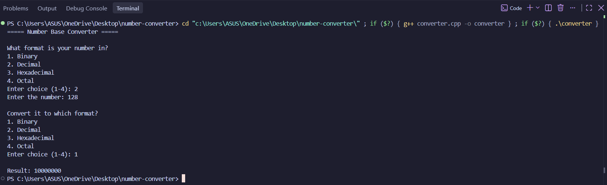

# 🔢 Number Base Converter

A simple C++ command-line tool that converts numbers between binary, decimal, hexadecimal, and octal formats, with strict input validation.

## ✨ Features

- 🔄 Convert between Binary, Decimal, Hexadecimal, and Octal
- ✅ Validates input strictly based on the selected number system
- ⚠️ Prompts the user again with "Enter valid number" if invalid input is given
- 🖥️ Clean, menu-driven console interface

## ⚙️ How It Works

1. 📥 The program asks what format your number is in (Binary/Decimal/Hexadecimal/Octal)
2. ⌨️ You enter the number
3. 🎯 The program asks which format you want to convert it to
4. 📤 It displays the converted result

## 💡 Example

===== Number Base Converter =====

What format is your number in?
1. Binary
2. Decimal
3. Hexadecimal
4. Octal
Enter choice (1-4): 2
Enter the number: 255

Convert it to which format?
1. Binary
2. Decimal
3. Hexadecimal
4. Octal
Enter choice (1-4): 1

Result: 11111111

## 📸 Output Screenshot

## 🛠️ How to Compile and Run

g++ -std=c++17 -o converter converter.cpp
./converter

## 👤 Author

Ayush Kurhade
